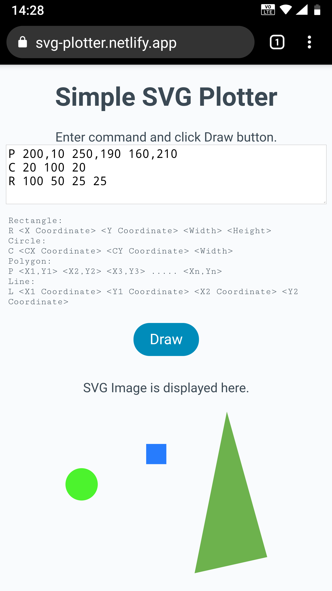

# Simple SVG Plotter 
Given various drawing commands from within a text area, the application draws them in real-time onto an SVG element. 

## Setup:
Follow the steps below to setup this application. 

```
$npm install
```

## Start application:

```
$npm start
```

Open http://localhost:3000 
The application looks identical on Google Chrome or Mozilla Firefox.  

## Usage: 

Enter a command and click Draw button to display SVG image. 

```
Rectangle:
R <X Coordinate> <Y Coordinate> <Width> <Height>
Circle:
C <CX Coordinate> <CY Coordinate> <Width>
Polygon:
P <X1,Y1> <X2,Y2> <X3,Y3> ..... <Xn,Yn>
Line:
L <X1 Coordinate> <Y1 Coordinate> <X2 Coordinate> <Y2 Coordinate>
```

## Bonus Features: 
### Additional Command:
Another drawing command to draw a line. Use the command below. 

```
L <X1 Coordinate>, <Y1 Coordinate>, <X2 Coordinate>, <Y2 Coordinate>
```

### Mobile responsive:
The application can also be used on mobile phone. The layout is different for mobile and desktop.


See mobile.png and desktop.png




